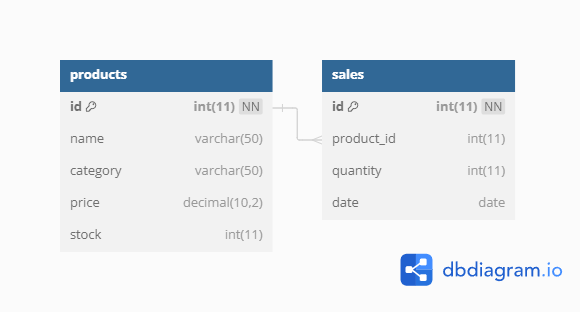

# Supermarket Database Project
Este repositorio contiene scripts SQL y los archivos relacionados de un proyecto de base de datos de un supermercado con la finalidad de practicar el uso de comando básicos y SQL y Queries.

## Estructura del Proyecto
El proyecto está organizado de la siguiente manera:

#### scripts/
 Directorio que contiene los scripts SQL para la creación de la base de datos, inserción de datos y consultas.

- create.sql: Script para crear la estructura de la base de datos y las tablas necesarias.

- insert_data.sql: Script para insertar datos de ejemplo en las tablas.

- basic_queries.sql: Script con consultas SQL básicas para operaciones comunes.

- advanced_queries.sql: Script con consultas SQL más avanzadas para análisis detallados.

#### database/
Directorio que almacena archivos relacionados con la base de datos.

- supermarket_db.sql: Archivo SQL que contiene la estructura completa y datos de ejemplo de la base de datos.

- DER.png: 
  Diagrama de entidad-relación que representa la estructura de la base de datos.
  **Entidades Principales:**
    * Products (Productos)
    * Sales (Ventas)
  
  **Relaciones:**
    * **Products <-> Sales: Relación uno a muchos (one-to-many)**
      

#### screenshots/ 
Incluye capturas de pantalla relevantes que muestran la interfaz de usuario y las consultas SQL ejecutadas.

## Uso
- Descarga la base de datos de supermarket_db.sql y guárdala en tu servidor MySQL o en phpMyAdmin. 
- Descarga el archivo DER.png y guárdala en tu servidor MySQL o en phpMyAdmin.
- Utiliza el script `insert_data.sql` para cargar datos de ejemplo en la base de datos, simulando información típica de un supermercado.
- Utiliza las queries de los archivos `basic_queries.sql` y `advanced_queries.sql` que contienen ejemplos de consultas SQL que puedes ejecutar para obtener información específica de la base de datos.

## Contacto
- Email: [aularafrica@gmail.com](mailto:aularafrica@gmail.com)
- LinkedIn: [Africa Aular](https://www.linkedin.com/in/africaaular/)
- GitHub: [AFRIAULAR](https://github.com/AFRIAULAR)

## AfriCode{💜}
